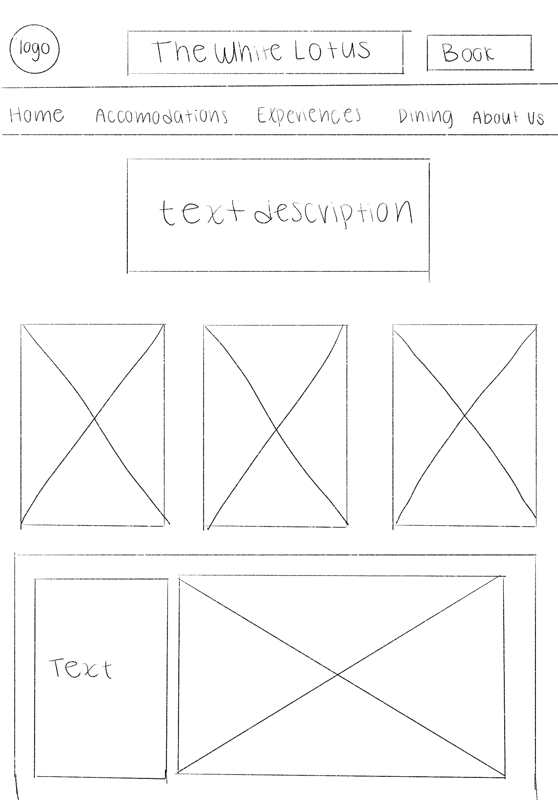
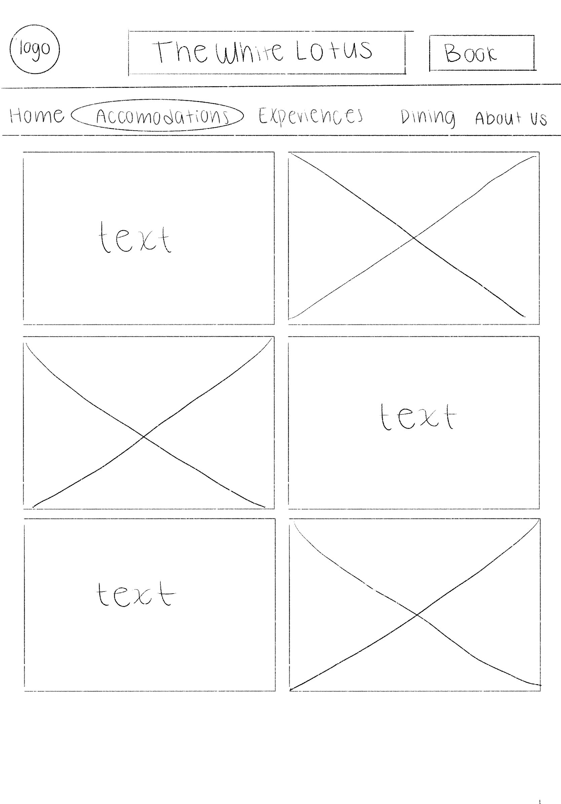
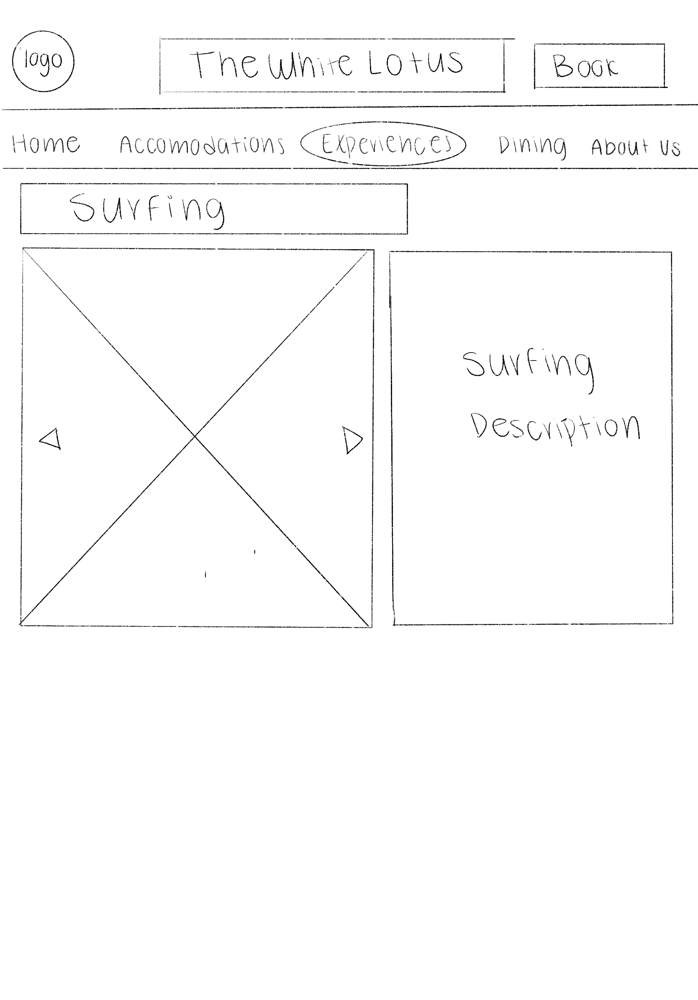
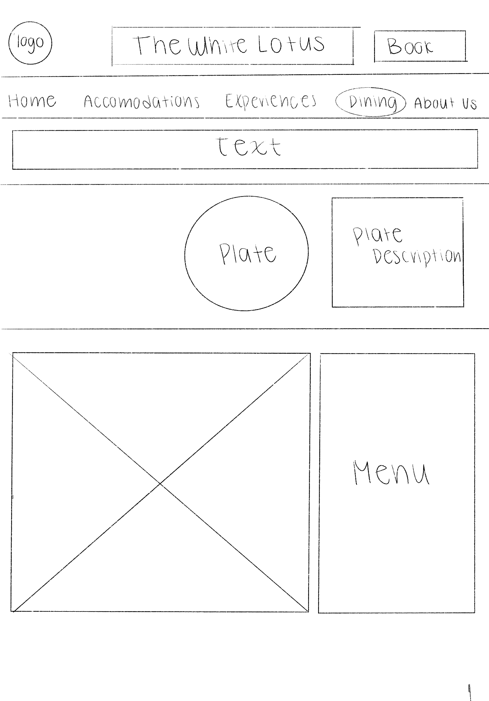
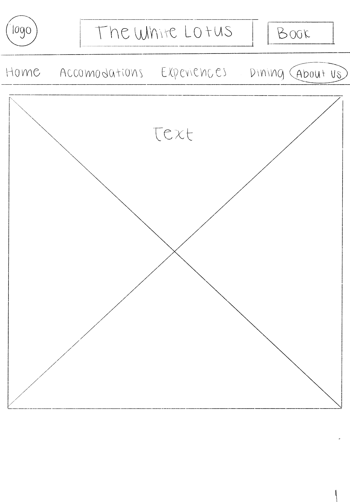

# Final Project Proposal

## Concept
Make the White Lotus website a ready to launch site, including all the msissing elements a hotel website would use

## Inspiration Reference
https://www.ahshotelassets.com/
https://www.oneandonlyresorts.com/cape-town
https://www.waldhaus-sils.ch/en
https://www.fourseasons.com/tamarindo/
Moodboard: https://pin.it/4kbBBVetH

## HTML/CSS/Javascript
1. A calendar so guests can check available dates and tarifs to book a room
2. A better design to the experiences page where guests can have information about each activity as they click the buttons
3. Include videos in the website to make it more attractive
4. For the rotating plate animation include more plates so it has everything from the menu and it looks more complex
5. Include a photpo of the menu with prices
6. Text animations

## Wireframes

