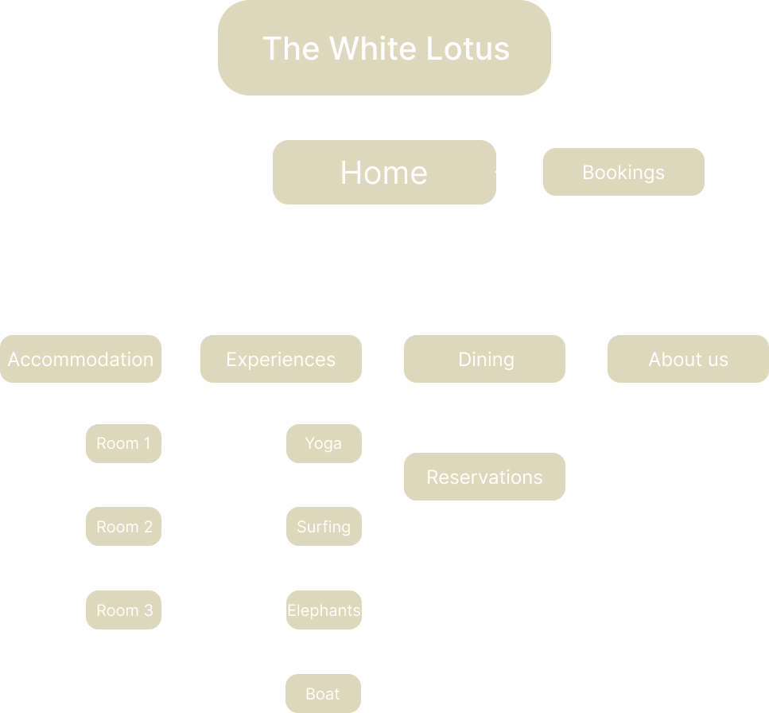

# The White Lotus Thailand Hotel

The White Lotus is a TV show where each season you see a week in a hotel from the perspective of different people, the hotel itself doesn't exist, but I want to create a website as if the hotel was an actual resort that you can go to. The new season happens in Thailand which is also where the hotel I'm making is going to be, specifically in Koh Samui. The website's aesthetic needs to be elegant, minimalistic with a tropical emphais, and with green tones.

## Inspiration
- Website: https://www.aman.com/
- Pinterest Board: https://pin.it/6JrlNPtZI

## Concepts I will use
- External css for styling
- href, ../, /, ./ for the website homepage and links
- Navigation bar for the homepage
- Boxes for design + Align elements
- ```<span>``` for editing single elements
- Classes for adding style to specific things of my website
- ```<div>``` for defining sections within each page

## Concepts I want to learn
- Basic animations for elements/images, such as slideshow 
- Inserting videos

## Sitemap
